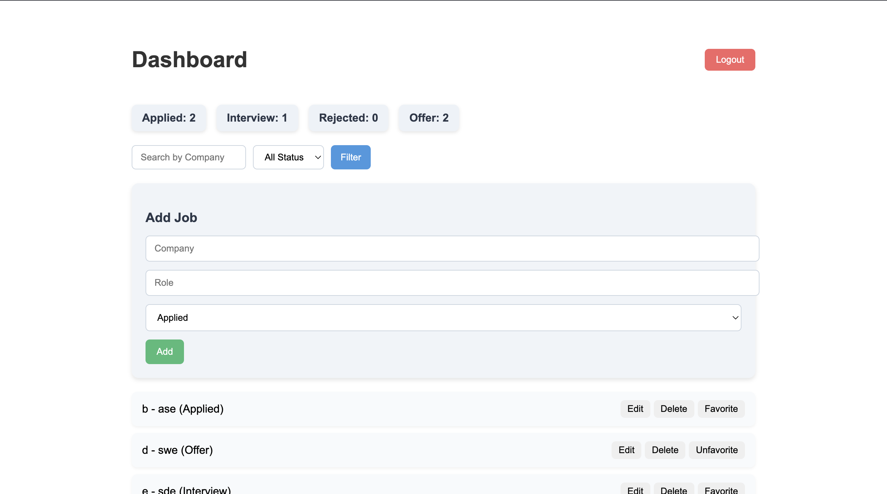
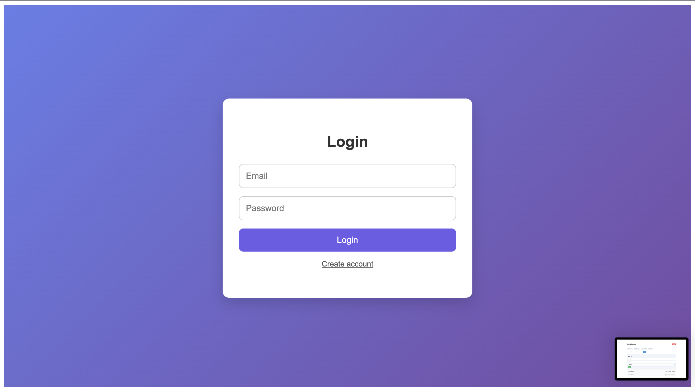
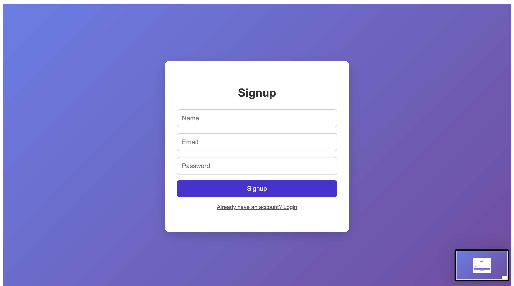
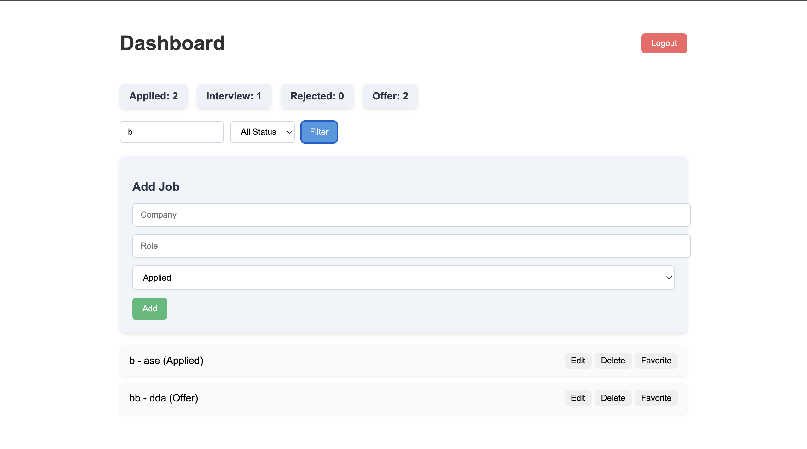

# 🚀 Job Tracker Application

A full-stack **Job Tracker Platform** built with **React, Node.js, Express, and MongoDB** to help users manage and track job applications efficiently.

> ✨ Made with ❤️ for job seekers.

---

## 🌟 Features

- 🔐 JWT Authentication (Login / Logout)
- ➕ Add Job Applications
- ✏️ Edit Job Details
- 🗑️ Delete Jobs
- 🔍 Search Jobs by Company Name
- 🎯 Filter Jobs by Status (Applied / Interview / Rejected / Offer)
- ⭐ Mark Jobs as Favorite
- 📊 Dashboard Stats (Applied, Interview, Rejected, Offer)
- 👤 User-specific job data
- 📱 Responsive & Clean UI

---

## 🖼️ Screenshots

### 📊 Dashboard & Job Stats

### 📝 Job Management (Add / Edit / Filter / Favorite)

### 📝 Job Management (Add / Edit / Filter / Favorite)

### 📝 Job Management (Add / Edit / Filter / Favorite)

### 📝 Job Management (Add / Edit / Filter / Favorite)

> 📌 **How to add screenshots**
1. Create a folder named **`screenshots`** in your project root  
2. Add images:
   - `dashboard.png`
   - `job-management.png`
3. Commit & push → GitHub will auto-render them

---

## 🛠️ Tech Stack

### Frontend
- React
- React Router
- Axios
- CSS (Custom UI)

### Backend
- Node.js
- Express.js
- MongoDB & Mongoose
- JWT Authentication

---

## 📂 Project Structure

job-tracker/
│
├── frontend/
│ ├── src/
│ │ ├── components/
│ │ │ └── JobForm.jsx
│ │ ├── pages/
│ │ │ └── Dashboard.jsx
│ │ ├── services/
│ │ │ └── api.js
│ │ ├── css/
│ │ │ ├── Dashboard.css
│ │ │ └── JobForm.css
│ │ └── App.js
│
├── backend/
│ ├── routes/
│ │ └── jobRoutes.js
│ ├── models/
│ │ └── Job.js
│ ├── middleware/
│ │ └── authMiddleware.js
│ ├── server.js
│ └── .env